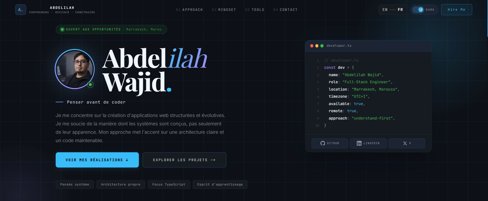

# Kanata System

A portfolio project focused on building scalable structure using Next.js and TypeScript, with emphasis on separation of concerns and maintainable architecture.

## Concept

This project is built to practice system thinking rather than just UI development.

The goal is to build applications with clear structure, where:

- logic is separated from UI
- content is managed independently
- components remain reusable and predictable

The multilingual system is designed so that `useLocale()` only handles state, while content is accessed through pure functions. This keeps the UI clean and decoupled.

## Tech Stack

| Technology | Purpose                |
| ---------- | ---------------------- |
| Next.js    | App Router & rendering |
| React      | UI layer               |
| TypeScript | Type safety            |
| Tailwind   | Styling                |

No external UI libraries are used. All components and styles are custom-built.

## Architecture

The project follows a layered structure:

Content -> Data -> Tokens -> Hooks -> Components -> Sections -> Pages

This structure is intentionally organized to simulate how larger applications are built.

### Structure

```
src/
app/ # Routing and pages
data/ # Content and data logic
hooks/ # Shared logic
tokens/ # Design system
components/ # UI building blocks
sections/ # Page sections
```

### Separation of Concerns

- Content is isolated from components
- Logic is separated into hooks
- UI remains reusable and predictable

## Features

### Implemented

- Multilingual system (EN / FR)
- Theme switching (dark / light)
- Responsive layout
- Dynamic routing (projects)
- Scroll animations

### Not Implemented

- Authentication system
- Backend API
- Database
- Admin dashboard

## Key Decisions

### No External UI Libraries

Avoided UI libraries to better understand core rendering and styling.

### Layered Architecture

Used a structured architecture to simulate real-world scalable systems.

### Content Separation

Kept content outside components to allow easy scaling and localization.

### Avoid Over-Abstraction

Kept the system simple and avoided unnecessary complexity.

## Preview



## Setup

```bash
git clone https://github.com/kanata-kan/kanata-system.git
cd kanata-system
npm install
npm run dev
```

## Status

In progress - actively improving structure and refining architectural decisions.

Built to learn system design, not just build interfaces.

---

# Screenshots Needed

Don't exaggerate features. Take these essential screenshots:

## 1. Home Page (Required)

The most important screenshot showing:

- Hero section
- Navigation bar
- Overall structure

Name it:

```bash
home.png
```
